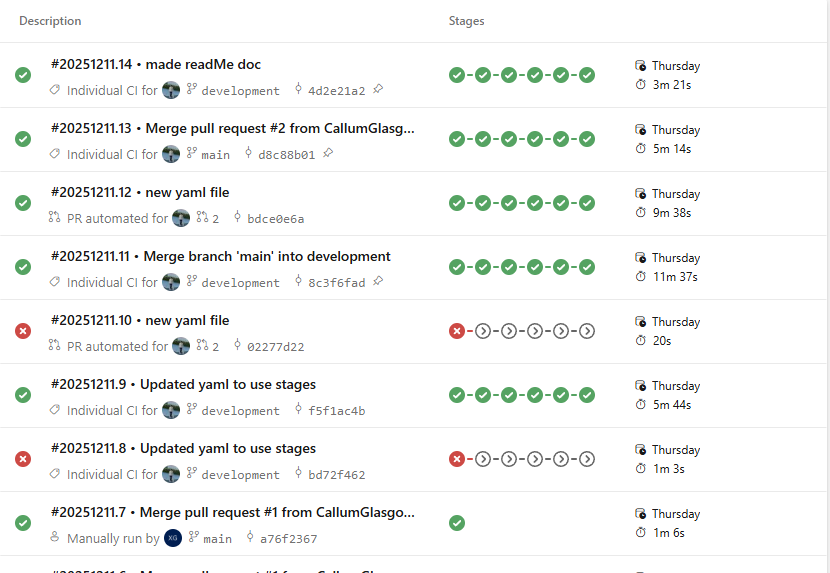
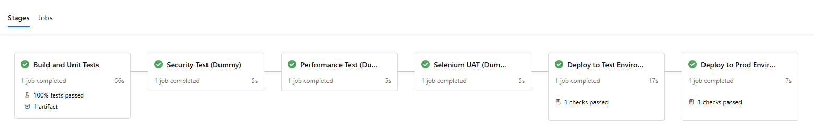
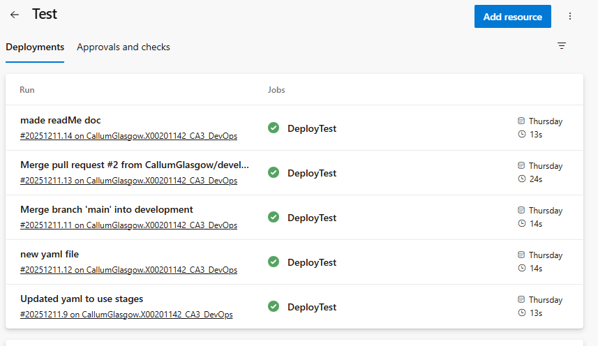

# Project Name
X00201142_CA3_DevOps
## Overview
This projects is a simple calculator application built using Gradle. The app includes basic functions such as addition, subtraction, multiplication and division. With additional arithmetic such as square and cube a number.

Using this app i can test and build a CI/CD pipeline for CA3 building on from what i made in CA2. Using Azure pipeline and a YAML file i created a multi stage pipeline to build, test and deploy with manual approval gates, reporting and included placeholder stages for security, performance and UAT testing to be added.

I focused more on the devops side rather than application complexity.

## Technologies Used
- Java
- Gradle
- Azure DevOps
- GitHub
- JaCoCo Coverage

## Local Development Setup
```console
git clone https://github.com/CallumGlasgow/X00201142_CA3_DevOps.git
```

```console
./gradlew build
```
```console
./gradlew run
```
```console
./gradlew test
```
check reports
```console
build/reports/jacoco/test/html/index.html
```
## Application Features

- Addition
- Subtraction
- Multiplication
- Division
- Square
- Cube

All functions tested and covered with over 80% coverage.

## CI Pipeline Implementation


CI/CD pipeline implemented on Azure pipeline using YAML file triggered on main and development branches. requires PR approval before merging to main.

Multi stage
1. Build - build Gradle project, run tests and generate code coverage with a requirement of 80% using JaCoCo.
2. Security - currently implemented as a dummy test.
3. Performance - currently implemented as a dummy test.
4. UAT - currently implemented as a dummy test.
5. DeployTest - deploy to Test environment requires manual approval.
6. DeployProd - deploy to Prod environment requires manual approval.



## Branch Policies and Protection

- requires Pull Request to push to main
- requires status check to pass before merging PR
- manual approval gates added to Prod and Test environments

## Environment Setup and Configuration
Two environments setup, Prod and Test, using Azure DevOps.

- Test Environment: Used for validating builds and testing before deploying to Prod. Requires approval for deployment. 



- Prod Environments: Represents the live environment shown to users. Requres manual approval for deployment.


## Testing Strategy

- Unit Tests for Calculator functions with more than 80% code coverage required using JaCoCo reports. If less pipeline fails.

- publish results to pipeline

- added dummy placeholders for Security, Performance and UAT testing.
- Dummy tests to be replaced with real tests and generate reports. 

## Troubleshooting 
test locally that these all pass
```bash
./gradlew build
```
```bash
./gradlew run
```
```bash
./gradlew test
```
If pipeline failed check error message and re run

If JaCoCoTestReport fails check local test coverage

If PR is blocked check approval and status of pipeline

If Deployment to environments blocked ensure approval has been granted
