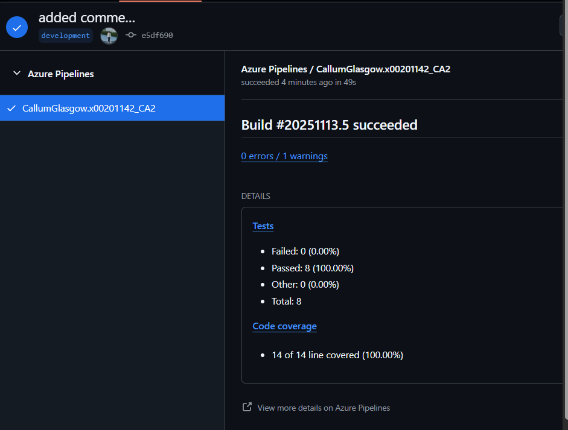
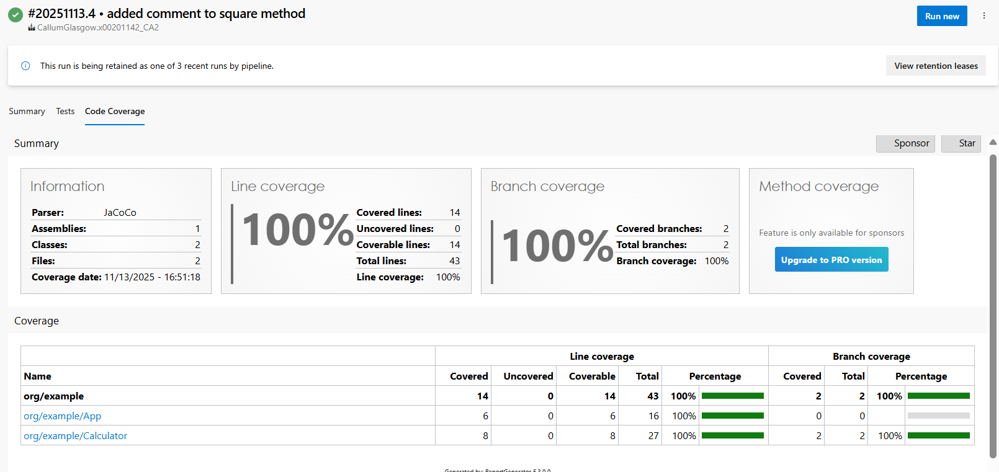
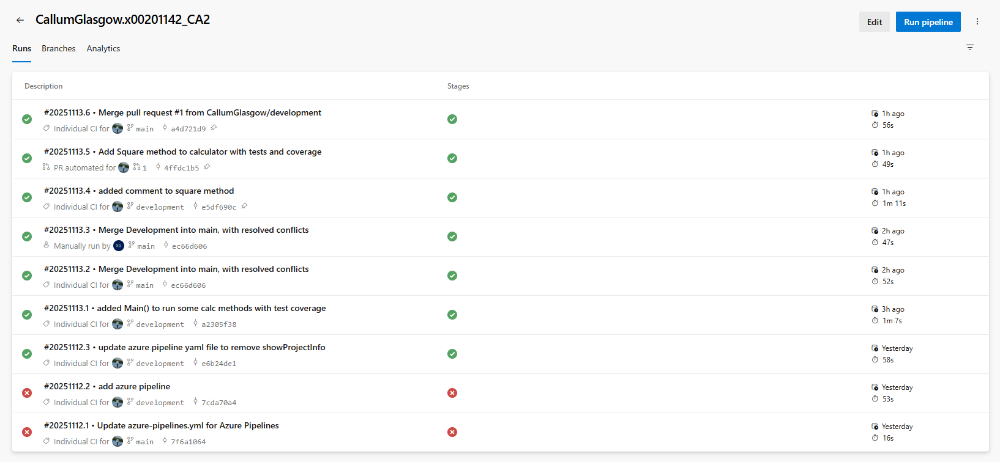
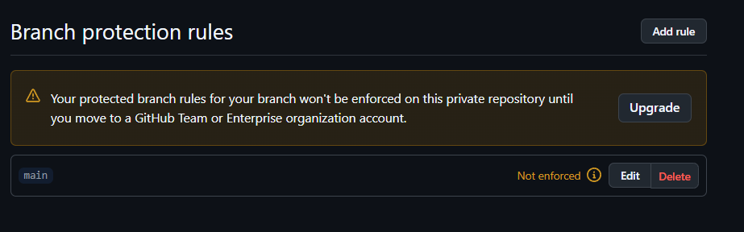
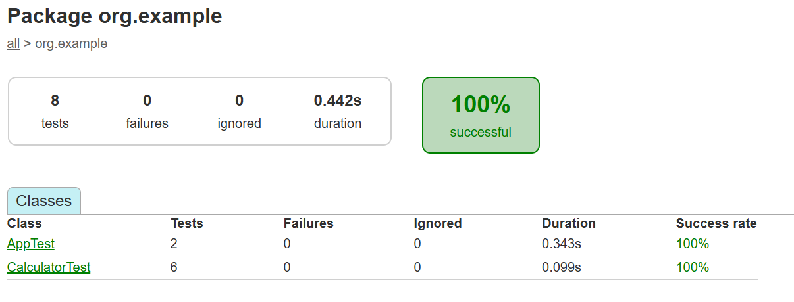
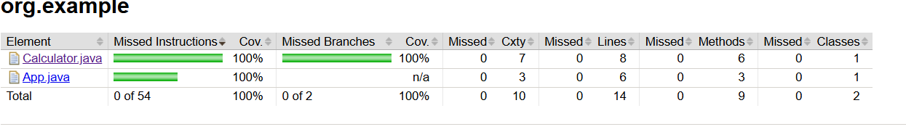

# x00201142_CA2

# Calculator App
Callum Glasgow X00201142

# Overview

This project is a simple Gradle Calculator App. It is for the purpose of showing of and demonstrating Continuous Integration (CI) practices on an Azure Pipeline.

This Calculator offers methods for basic math operations such as Addition, Subtraction, Multiplication and Division.

The main part of this project is ensuring these methods are tested and have sufficient code coverage meeting the minimum requirement of 80% coverage. 

It also focuses on pipeline and repo commits across multiple branches and PR's

--

# Technologies Used
- Java: Code Language to write calculator methods.
- Gradle: Used for build automation
- JaCoCO: Used for Test coverage and reports
- Azure PipeLines: CI/CD pipeline
- GitHub: used for source Control

--

# Local Development Setup

1. Clone Repo 

2. Checkout Development Branch: 
    git checkout development

3. Build and run tests using Gradle
    ./gradlew build
    ./gradlew test

4. Run App
    ./gradlew run

--

# Application Features
- Addition: Add two numbers
- Subtraction: Subtracts second number from first
- Multiply: Multiply two numbers
- Division: Divide first number by Second and throw exception if second number is 0
- Square: Square a number i.e product of itself

--

# CI Pipeline Implementation
Uses azure-pipelines.yml
- Triggers on branches main and development
- Gradle build to compile code and run tests
- JaCoCo to get coverage and enforce 80% requirement
- Publish Test reports

Pipeline is triggered by any commits on main or development branches including Pull Requests. Ensuring all changes pass tests and code quality requirements before merging.

I am currently missing SonarQube, i tried to implement it by following the labs, that didnt work since version differences and compatibility issues. I tried many different versions of Sonar and none seemed to work. I then moved onto forums such as stack overflow to see how others got it working, still no solution worked. I decieded to move on and get as much done as i could and hopefully come back and get a fix.
I understand the importance of SonarQube and have some experience from my work placement where i got reports on stuff like code smells etc. Its a crucial check to analyise the code not just for passing and failling test but find redunant or inefficient code that should be upgraded to improve performance and remove tech debt. 
I would have liked to get this in but just couldnt get a working version.

## Successful PR Check on GitHub

## Azure Pipeline Code Coverage Visual

## Azure Pipeline Run History

--

# Branch Policies and Protection
- main: production, what would actually go out to users
- development: dev branch to put active projects before public release
- any other branch would be a specifc ticket branche that would then move to dev then to main. ensuring all quality checks and tests are covered before putting code out.

    ## Branch Ruleset: "MainBranchProtection"
    - Target Branch set to default (main)
    - Enforcement Status: Active
    - Rules Configured
        - Restrict Deleteions
        - Require a pull request before merging ( at least 1 approval required)
        - checks must pass
        - Block force pushes
    
    ## Branch protection rules: main
    - Applied to branch main
    - Not Enforced
    - Requires a pull request before merging ( at least 1 approval )
    - Require status checks to pass before merging. 
    - Require branches to be up to date before merging.

** Note: This rule can only be enforced for a private repository on a github Team organisation account. 

    ## Worflow
    1. Create feature branch from development e.g such as ticket name
    2. Work on that branch with commits
    3. Open Pull Request to development
    4. after approvals and testing merge to development
    5. DevTeam Periodically merges developemnt into main.

--

# Testing Strategy

1. Unit Tests implemented for all methods. 
    - ensures results are same as expected results and that methods are performing properly.
    - quickest and easiest way to detect failures or incorrect methods
    - added tolerance on Calculator methods (delta) to allow for test to pass if they are within range of nearest answer. Since maths equations can become complex and rounded etc.

2. Coverage using JaCoCo
    - ensure every bit of code can be covered when testing including edge cases.
    - ensures a level of requirement so that work is not rushed and is taken the time to be tested before and commits or mergers

 Sample test
 @Test
    void testSquare() {
        Calculator calc = new Calculator();
        assertEquals(81.0, calc.square(9), 0.0001, "9 squared should equal 81");
    }
## Test Reports

## Coverage Reports

--

# Troubleshooting Guide

1. if pipeline doesnt trigger.
    - ensure on branch main or development
    - verify YAML file exists.
    - if everything looks in order, try push another small change such as adding a comment. Happened to me but retriggering with another commit with just a comment fixed it.

2. if tests fail
    - check any recent changes made on your local branch
    - check inputs and expected results to see if is correct
    - check reports such as  app/build/reports/test for more details.

--
## References

DevOps Labs - https://github.com/TUDublin-Git/DOCID-Labs/tree/main

